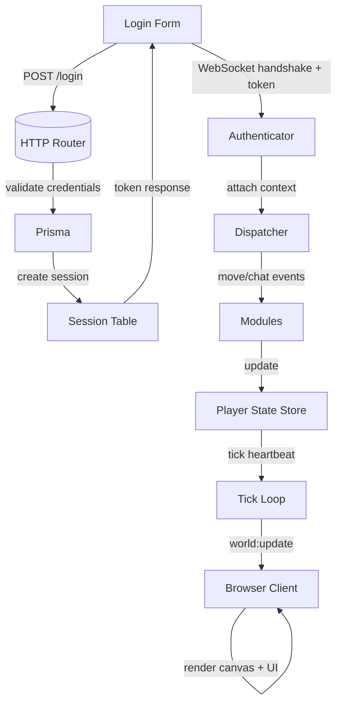

# Ellarwick Architecture Guide

This document explains how the prototype is structured, how data flows between modules, and where to find the primary entry points when extending the game.

---

## High-Level Overview

Ellarwick is a server-authoritative MMO prototype with a Node.js backend and a browser-based client written in vanilla JavaScript. The backend exposes:

1. A minimal HTTP API for user login.
2. An authenticated WebSocket gateway that routes validated messages to modular handlers.
3. A shared player state store and tick loop that broadcast authoritative snapshots at 50 ms intervals.

The client renders the world on a canvas, relays user intents (movement, chat, ping), and mirrors the server snapshots for display.

---

## Data Flow

1. **Login** — The browser submits credentials to `POST /login`. The server validates them with Prisma, prunes expired sessions, and returns a fresh token plus user metadata.
2. **WebSocket auth** — The client reconnects over WebSocket, passing the token as a query parameter. `authenticateWebSocket` validates the token and injects auth context before the connection enters the dispatcher.
3. **Message routing** — Every incoming message is normalised, Zod-validated, and routed by the dispatcher to domain modules (`system`, `chat`, `movement`).
4. **Shared state** — Modules mutate the `playerStateStore`, which emits lifecycle events. The tick loop listens for those events, marks the world snapshot as dirty, and periodically broadcasts `world:update` messages to all players.
5. **Client render** — The browser mirrors the incoming snapshots, re-renders the roster, updates the chat log, and draws the canvas around the local player. Movement keys send intents back to the server, closing the loop.

---

## Backend Files and Responsibilities

| Path | Purpose |
| ---- | ------- |
| `server/src/index.js` | Bootstraps HTTP + WebSocket servers, attaches the dispatcher, registers modules, and starts the tick loop. |
| `server/config/config.js` | Validates environment variables and exposes typed configuration (host, port, database, crypto). |
| `server/src/db/prismaClient.js` | Shared Prisma client with graceful shutdown hooks used by HTTP and WebSocket modules. |
| `server/src/server/http/router.js` | Handles routing for `POST /login`, including CORS preflight. |
| `server/src/server/http/routes/login.js` | Parses and validates login requests, checks credentials, issues session tokens. |
| `server/src/server/auth/password.js` | PBKDF2 password hashing and verification helpers. |
| `server/src/server/auth/session.js` | Session lifecycle helpers for creating, pruning, and verifying tokens. |
| `server/src/server/ws/authenticate.js` | Validates WebSocket upgrade requests and enriches sockets with auth context. |
| `server/src/server/ws/dispatcher.js` | Core router that validates JSON messages and fans them out to registered handlers. |
| `server/src/server/ws/modules/system.js` | Responds to diagnostics events such as `ping`. |
| `server/src/server/ws/modules/chat.js` | Validates and broadcasts chat messages to all connections. |
| `server/src/server/ws/modules/movement.js` | Normalises movement intents, updates the shared player state, and broadcasts changes. |
| `server/src/server/state/playerStateStore.js` | Shared in-memory store that tracks player snapshots and emits lifecycle events. |
| `server/src/server/tick/tickLoop.js` | Interval manager that emits tick lifecycle events. |
| `server/src/server/tick/registerTickLoop.js` | Wires the tick loop to the dispatcher, throttles world snapshot broadcasts. |

Supporting utilities:

- `server/utils/body.js` – Streams HTTP request bodies into strings.
- `server/utils/loadEnv.js` – Loads `.env` files without crashing if absent.

---

## Frontend Files and Responsibilities

| Path | Purpose |
| ---- | ------- |
| `client/src/main.js` | Orchestrates UI bootstrap, login flow, network wiring, and global event listeners. |
| `client/src/config.js` | Builds HTTP/WS endpoints from Vite env vars or browser location. |
| `client/src/constants.js` | Shared constants controlling movement cadence and render scale. |
| `client/src/state/store.js` | Global client state (auth, socket, tick metadata, world snapshot). |
| `client/src/world/players.js` | Data helpers for maintaining the client-side mirror of player records. |
| `client/src/network/http.js` | Performs the login request. |
| `client/src/network/websocket.js` | Manages the authenticated WebSocket, dispatches incoming payloads, and exposes helpers to send intents. |
| `client/src/input/inputState.js` | Normalises keyboard input into movement vectors. |
| `client/src/input/movement.js` | Handles keyboard events, throttles movement intents, and leverages the WebSocket helper. |
| `client/src/canvas/renderer.js` | Configures the canvas and renders the latest world snapshot. |
| `client/src/gameLoop.js` | Coordinates the render loop and movement heartbeat. |
| `client/src/ui/layout.js` | Renders the static DOM scaffold for login and in-game panels. |
| `client/src/ui/messages.js` | Stores and renders chat/system messages. |
| `client/src/ui/roster.js` | Renders the player roster sidebar. |
| `client/src/ui/status.js` | Updates header badges for connection status, tick timing, and login feedback. |
| `client/src/utils/id.js` | Generates local-only identifiers for UI entries. |
| `client/src/utils/text.js` | Escapes HTML and formats timestamps. |
| `client/src/style.css` | Visual styling for login, HUD, chat, and canvas wrapper. |

---

## Runtime Sequence

1. **Bootstrap** – `client/src/main.js` renders the layout, initialises the canvas, and starts the animation loop.
2. **Login** – The user submits credentials; `network/http.js` authenticates and stores the token. `network/websocket.js` opens an authenticated socket.
3. **Dispatcher handshake** – The backend attaches the connection via `dispatcher.attachConnection`, ensuring the player state store has an entry.
4. **Movement** – Keyboard events call `input/movement.js`, which generates a normalised vector and sends a `move` intent. `movement.js` on the server applies the update, emits events, and acknowledges.
5. **Heartbeat** – `registerTickLoop` periodically emits `world:update` snapshots. The client updates state via `network/websocket.js`, re-renders the roster, and `canvas/renderer.js` draws the scene.
6. **Chat** – Chat form submits to `network/websocket.js`, which sends `chat:send`. The server validates and broadcasts; all clients append to their local logs.
7. **Logout** – Clicking “Log Out” calls `clearSession`, which drops the socket, resets state, and returns to the login panel.

---

## Extending the Prototype

- **New WebSocket message type** – Create a module in `server/src/server/ws/modules/`, register it in `modules/index.js`, and add corresponding client logic under `client/src/network/` or `client/src/ui/`.
- **Server tick consumers** – Listen to `dispatcher.emitter` events or subscribe to `tick` events from `tickLoop`. Use the player state store to query or mutate players.
- **Client features** – Add modules under `client/src/ui` or `client/src/world` so responsibilities remain focused. Reuse the exported helpers instead of duplicating DOM queries.

---

For a quick inventory of outstanding milestones, refer to `TODO.md`. The code comments added across modules highlight intent and help navigate the control flow while developing new systems.
